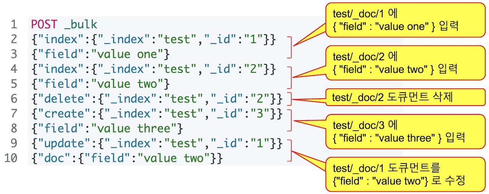

# 4.3 벌크 API - \_bulk API

&#x20; 여러 명령을 배치로 수행하기 위해서 **\_bulk API**의 사용이 가능합니다. \_bulk API로 **index, create, update, delete**의 동작이 가능하며 delete를 제외하고는 명령문과 데이터문을 한 줄씩 순서대로 입해야 합니다. delete는 내용 입력이 필요 없기 때문에 명령문만 있습니다.


\_bulk 의 명령문과 데이터문은 반드시 한 줄 안에 입력이 되어야 하며 줄바꿈을 허용하지 않습니다.


&#x20; 다음은 \_bulk 명령을 실행한 예제입니다. 각 명령의 결과가 items에 배열로 리턴됩니다.




```javascript
POST _bulk
{"index":{"_index":"test", "_id":"1"}}
{"field":"value one"}
{"index":{"_index":"test", "_id":"2"}}
{"field":"value two"}
{"delete":{"_index":"test", "_id":"2"}}
{"create":{"_index":"test", "_id":"3"}}
{"field":"value three"}
{"update":{"_index":"test", "_id":"1"}}
{"doc":{"field":"value two"}}
```





```javascript
{
  "took" : 440,
  "errors" : false,
  "items" : [
    {
      "index" : {
        "_index" : "test",
        "_type" : "_doc",
        "_id" : "1",
        "_version" : 1,
        "result" : "created",
        "_shards" : {
          "total" : 2,
          "successful" : 1,
          "failed" : 0
        },
        "_seq_no" : 0,
        "_primary_term" : 1,
        "status" : 201
      }
    },
    {
      "index" : {
        "_index" : "test",
        "_type" : "_doc",
        "_id" : "2",
        "_version" : 1,
        "result" : "created",
        "_shards" : {
          "total" : 2,
          "successful" : 1,
          "failed" : 0
        },
        "_seq_no" : 1,
        "_primary_term" : 1,
        "status" : 201
      }
    },
...
```




&#x20; 위 명령이 실행하는 동작들은 다음과 같습니다.



&#x20; 모든 명령이 동일한 인덱스에서 수행되는 경우에는 아래와 같이 `<인덱스명>/_bulk` 형식으로도 사용이 가능합니다.

.png>)

&#x20; 벌크 동작은 따로따로 수행하는 것 보다 속도가 훨씬 빠릅니다. 특히 대량의 데이터를 입력 할 때는 반드시 \_bulk API를 사용해야 불필요한 오버헤드가 없습니다. **Logstash** 와 **Beats** 그리고 Elastic 웹페이지에서 제공하는 대부분의 언어별 클라이언트에서는 데이터를 입력할 때 \_bulk를 사용하도록 개발되어 있습니다.


Elasticsearch 에는 커밋이나 롤백 등의 트랜잭션 개념이 없습니다. \_bulk 작업 중 연결이 끊어지거나 시스템이 다운되는 등의 이유로 동작이 중단 된 경우에는 어느 동작까지 실행되었는지 확인이 불가능합니다. 보통 이런 경우 전체 인덱스를 삭제하고 처음부터 다시 하는 것이 안전합니다.


### 파일에 저장 내용 실행

&#x20; 벌크 명령을 파일로 저장하고 curl 명령으로 실행시킬 수 있습니다. 저장한 명령 파일을 `--data-binary` 로 지정하면 저장된 파일로 부터 입력할 명령과 데이터를 읽어올 수 있습니다. 다음 내용을 **bulk.json** 이라는 이름의 파일로 먼저 저장 해 보겠습니다.


```
{"index":{"_index":"test","_id":"1"}}
{"field":"value one"}
{"index":{"_index":"test","_id":"2"}}
{"field":"value two"}
{"delete":{"_index":"test","_id":"2"}}
{"create":{"_index":"test","_id":"3"}}
{"field":"value three"}
{"update":{"_index":"test","_id":"1"}}
{"doc":{"field":"value two"}}
```


&#x20;  다음 명령으로 **bulk.json** 파일에 있는 내용들을 \_bulk 명령으로 실행 가능합니다. 파일 이름 앞에는 `@`문자를 입력합니다.


```bash
$ curl -XPOST "http://localhost:9200/_bulk" -H 'Content-Type: application/json' --data-binary @bulk.json
```

