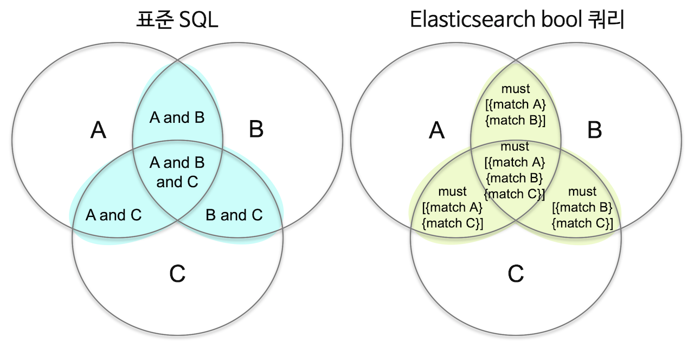
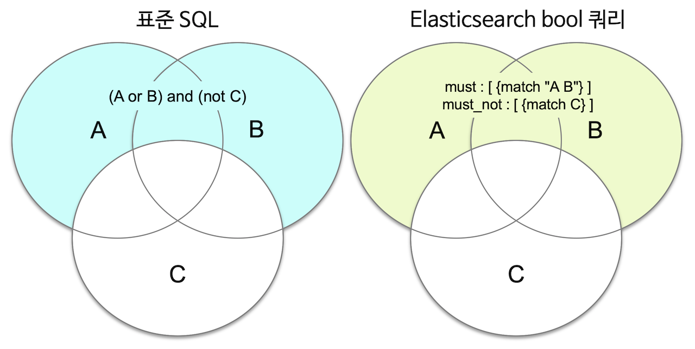

# 5.2 Bool 복합 쿼리 - Bool Query

  앞의 query\_string 쿼리는 여러 조건을 조합하기에는 용이한 문법이지만 옵션이 한정되어 있습니다. 본문 검색에서 여러 쿼리를 조합하기 위해서는 상위에 **bool** 쿼리를 사용하고 그 안에 다른 쿼리들을 넣는 식으로 사용이 가능합니다. bool 쿼리는 다음의 4개의 인자를 가지고 있으며 그 인자 안에 다른 쿼리들을 배열로 넣는 방식으로 동작합니다.

* **must** : 쿼리가 참인 도큐먼트들을 검색합니다. 
* **must\_not** : 쿼리가 거짓인 도큐먼트들을 검색합니다. 
* **should** : 검색 결과 중 이 쿼리에 해당하는 도큐먼트의 점수를 높입니다. 
* **filter** : 쿼리가 참인 도큐먼트를 검색하지만 스코어를 계산하지 않습니다. must 보다 검색 속도가 빠르고 캐싱이 가능합니다.

  사용 방법은 다음과 같습니다.



```javascript
GET <인덱스명>/_search
{
  "query": {
    "bool": {
      "must": [
        { <쿼리> }, …
      ],
      "must_not": [
        { <쿼리> }, …
      ],
      "should": [
        { <쿼리> }, …
      ],
      "filter": [
        { <쿼리> }, …
      ]
    }
  }
}
```



다음은 단어 "quick"과 구문 "lazy dog"가 포함된 모든 문서를 검색하는 쿼리입니다.





```javascript
GET my_index/_search
{
  "query": {
    "bool": {
      "must": [
        {
          "match": {
            "message": "quick"
          }
        },
        {
          "match_phrase": {
            "message": "lazy dog"
          }
        }
      ]
    }
  }
}
```







```javascript
{
  "took" : 2,
  "timed_out" : false,
  "_shards" : {
    "total" : 1,
    "successful" : 1,
    "skipped" : 0,
    "failed" : 0
  },
  "hits" : {
    "total" : {
      "value" : 1,
      "relation" : "eq"
    },
    "max_score" : 1.3887084,
    "hits" : [
      {
        "_index" : "my_index",
        "_type" : "_doc",
        "_id" : "2",
        "_score" : 1.3887084,
        "_source" : {
          "message" : "The quick brown fox jumps over the lazy dog"
        }
      }
    ]
  }
}
```





  다음은 단어 "quick" 그리고 구문 "lazy dog"가 하나도 포함되지 않은 문서를 검색합니다.





```javascript
GET my_index/_search
{
  "query": {
    "bool": {
      "must_not": [
        {
          "match": {
            "message": "quick"
          }
        },
        {
          "match_phrase": {
            "message": "lazy dog"
          }
        }
      ]
    }
  }
}
```







```javascript
{
  "took" : 2,
  "timed_out" : false,
  "_shards" : {
    "total" : 1,
    "successful" : 1,
    "skipped" : 0,
    "failed" : 0
  },
  "hits" : {
    "total" : {
      "value" : 2,
      "relation" : "eq"
    },
    "max_score" : 0.0,
    "hits" : [
      {
        "_index" : "my_index",
        "_type" : "_doc",
        "_id" : "4",
        "_score" : 0.0,
        "_source" : {
          "message" : "Brown fox brown dog"
        }
      },
      {
        "_index" : "my_index",
        "_type" : "_doc",
        "_id" : "5",
        "_score" : 0.0,
        "_source" : {
          "message" : "Lazy jumping dog"
        }
      }
    ]
  }
}
```





  이렇게 bool 쿼리를 이용해서 복합적인 검색 기능을 구현할 수 있습니다. 특히 bool쿼리는 것은 이후에 설명할 정확도\(Relevancy\)의 예제를 위해서도 필요합니다.

  bool 쿼리의 **must**, **should** 등은 표준 SQL의 **AND**, **OR** 등과 **유사하지만 정확히 같지는 않습니다.** must는 SQL의 **AND** 연산자와 유사하게 동작하지만 bool 쿼리에는 표준 SQL의 **OR** 와 정확히 일치하게 동작한다고 할 수 있는 연산자는 없어서 처음에는 이해하기가 조금 어렵습니다.

  표준 SQL의 AND, OR 조건 들은 2개의 조건값에 대한 **이항 연산자** 입니다. 하지만 Elasticsearch의 must, must\_not, should 등은 내부에 있는 각각의 쿼리들에 대해 이 쿼리는 참 또는 거짓으로 적용하는 **단항 연산자**라고 생각을 하면 조금 더 이해하기 쉽습니다.



  **`(A or B) and (not C)`** 에 대한 쿼리를 하려면 elasticsearch의 경우 다음처럼 **A**와 **B**의 OR 조건의 match 쿼리로 하여 must 안에 넣고 **C**를 must\_not에 넣으면 됩니다.



