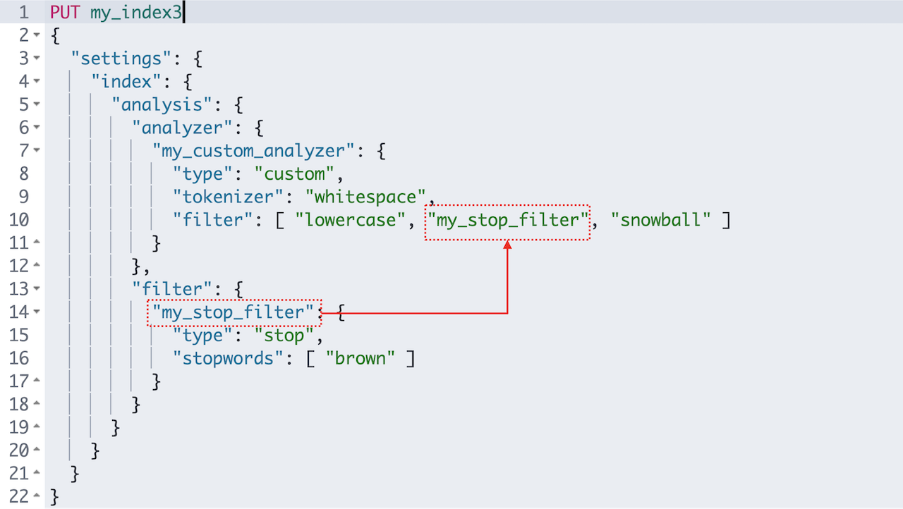

# 6.3.3 사용자 정의 애널라이저 - Custom Analyzer

  **\_analyze API**로 애널라이저, 토크나이저, 토큰필터들의 테스트가 가능하지만, 실제로 인덱스에 저장되는 데이터의 처리에 대한 설정은 **애널라이저만 적용할 수 있습니다**. 인덱스 매핑에 애널라이저를 적용 할 때 보통은 이미 정의되어 제공되는 애널라이저 보다는 토크나이저, 토큰필터 등을 조합하여 만든 **사용자 정의 애널라이저\(Custom Analyzer\)**를 주로 사용합니다. 이미 정의된 애널라이저들은 매핑에 정의한 text 필드의 **analyzer** 항목에 이름을 명시하기만 하면 쉽게 적용이 가능합니다.

  이 책에서는 사용자 정의 애널라이저만 설명하겠으니 Elasticsearch에 사전에 만들어진 애널라이저들은 [https://www.elastic.co/](https://www.elastic.co/) 홈페이지의 공식 도큐먼트를 참고하시기 바랍니다. 매핑에 아무 설정을 하지 않는 경우 디폴트로 적용되는 애널라이저는 **standard** 애널라이저 입니다.

  사용자 정의 애널라이저는 인덱스 **settings** 의 `"index" : { "analysis" :`  부분에 정의합니다. 생성한 다음에는 해당 인덱스에서 `GET` 또는 `POST <인덱스명>/_analyze` 명령으로 사용이 가능합니다. 다음은 **my\_index3** 안에 `whitespace` 토큰크나이저 그리고 `lowercase`, `stop`, `snowball` 토큰필터를 사용하는 `my_custom_analyzer` 라는 이름의 애널라이저를 추가하는 예제입니다.



```javascript
PUT my_index3
{
  "settings": {
    "index": {
      "analysis": {
        "analyzer": {
          "my_custom_analyzer": {
            "type": "custom",
            "tokenizer": "whitespace",
            "filter": [
              "lowercase",
              "stop",
              "snowball"
            ]
          }
        }
      }
    }
  }
}
```



  이제 **my\_index3** 에서 **my\_custom\_analyzer**를 사용할 수 있습니다.





```javascript
GET my_index3/_analyze
{
  "analyzer": "my_custom_analyzer",
  "text": [
    "The quick brown fox jumps over the lazy dog"
  ]
}
```







```javascript
{
  "tokens" : [
    {
      "token" : "quick",
      "start_offset" : 4,
      "end_offset" : 9,
      "type" : "word",
      "position" : 1
    },
    {
      "token" : "brown",
      "start_offset" : 10,
      "end_offset" : 15,
      "type" : "word",
      "position" : 2
    },
    {
      "token" : "fox",
      "start_offset" : 16,
      "end_offset" : 19,
      "type" : "word",
      "position" : 3
    },
    {
      "token" : "jump",
      "start_offset" : 20,
      "end_offset" : 25,
      "type" : "word",
      "position" : 4
    },
    {
      "token" : "over",
      "start_offset" : 26,
      "end_offset" : 30,
      "type" : "word",
      "position" : 5
    },
    {
      "token" : "lazi",
      "start_offset" : 35,
      "end_offset" : 39,
      "type" : "word",
      "position" : 7
    },
    {
      "token" : "dog",
      "start_offset" : 40,
      "end_offset" : 43,
      "type" : "word",
      "position" : 8
    }
  ]
}
```





### 사용자 정의 토큰필터

  토크나이저, 토큰필터의 경우에도 옵션을 지정하는 경우에는 사용자 정의 토크나이저, 토큰필터로 만들어 추가해야 합니다. 다음은 `stop` 토큰필터에 **"brown"**을 불용어로 적용한 **my\_stop\_filter** 사용자 정의 토큰필터를 생성하고 이것을 **my\_custom\_analyzer**에서 사용하도록 설정 한 예제입니다.


아래 명령 실행 전에 기존 my\_index3 인덱스는 먼저 삭제해야 합니다.




```javascript
PUT my_index3
{
  "settings": {
    "index": {
      "analysis": {
        "analyzer": {
          "my_custom_analyzer": {
            "type": "custom",
            "tokenizer": "whitespace",
            "filter": [
              "lowercase",
              "my_stop_filter",
              "snowball"
            ]
          }
        },
        "filter": {
          "my_stop_filter": {
            "type": "stop",
            "stopwords": [
              "brown"
            ]
          }
        }
      }
    }
  }
}
```





  이제 다시 **my\_custom\_analyzer**를 사용해서 텍스트를 분석 해 보면 **brown**이 불용어 처리가 되어 사라진 것을 확인할 수 있습니다.





```javascript
GET my_index3/_analyze
{
  "analyzer": "my_custom_analyzer",
  "text": [
    "The quick brown fox jumps over the lazy dog"
  ]
}
```







```javascript
{
  "tokens" : [
    {
      "token" : "the",
      "start_offset" : 0,
      "end_offset" : 3,
      "type" : "word",
      "position" : 0
    },
    {
      "token" : "quick",
      "start_offset" : 4,
      "end_offset" : 9,
      "type" : "word",
      "position" : 1
    },
    {
      "token" : "fox",
      "start_offset" : 16,
      "end_offset" : 19,
      "type" : "word",
      "position" : 3
    },
    {
      "token" : "jump",
      "start_offset" : 20,
      "end_offset" : 25,
      "type" : "word",
      "position" : 4
    },
    {
      "token" : "over",
      "start_offset" : 26,
      "end_offset" : 30,
      "type" : "word",
      "position" : 5
    },
    {
      "token" : "the",
      "start_offset" : 31,
      "end_offset" : 34,
      "type" : "word",
      "position" : 6
    },
    {
      "token" : "lazi",
      "start_offset" : 35,
      "end_offset" : 39,
      "type" : "word",
      "position" : 7
    },
    {
      "token" : "dog",
      "start_offset" : 40,
      "end_offset" : 43,
      "type" : "word",
      "position" : 8
    }
  ]
}
```





### 매핑에 사용자 정의 애널라이저 적용

  애널라이저를 실제 인덱스에 입력할 데이터에 적용하려면 **settings** 부분에서 만든 애널라이저를 **mappings** 의 text 필드별로 지정합니다. 앞에서 만든 **my\_custom\_analyzer** 를 **message** 필드에 적용하는 방법은 다음과 같습니다. **setting** 부분은 위 예제와 동일합니다.



```javascript
PUT my_index3
{
  "settings": {
    "index": {
      "analysis": {
        "analyzer": {
          "my_custom_analyzer": {
            "type": "custom",
            "tokenizer": "whitespace",
            "filter": [
              "lowercase",
              "my_stop_filter",
              "snowball"
            ]
          }
        },
        "filter": {
          "my_stop_filter": {
            "type": "stop",
            "stopwords": [
              "brown"
            ]
          }
        }
      }
    }
  },
  "mappings": {
    "properties": {
      "message": {
        "type": "text",
        "analyzer": "my_custom_analyzer"
      }
    }
  }
}
```



  이제 **my\_index** 에 **message** 필드에 입력되는 값은 위에 지정된 **my\_custom\_analyzer** 애널라이저가 적용됩니다. my\_index의 message 필드에 값을 입력하고 검색 해 보면 **brown**은 불용어 처리가 되어 검색되지 않는 것을 확인할 수 있습니다.



```javascript
PUT my_index3/_doc/1
{
  "message": "The quick brown fox jumps over the lazy dog"
}
```







```javascript
GET my_index3/_search
{
  "query": {
    "match": {
      "message": "brown"
    }
  }
}
```







```javascript
{
  "took" : 468,
  "timed_out" : false,
  "_shards" : {
    "total" : 1,
    "successful" : 1,
    "skipped" : 0,
    "failed" : 0
  },
  "hits" : {
    "total" : {
      "value" : 0,
      "relation" : "eq"
    },
    "max_score" : null,
    "hits" : [ ]
  }
}
```





### 

