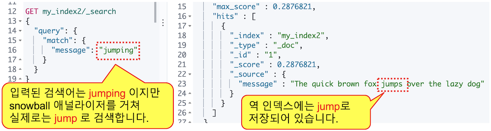

# 6.3 애널라이저 \(Analyzer\)

### \_analyze API

  Elasticsearch 에서는 분석된 문장을 `_analyze` API를 이용해서 확인할 수 있습니다. 토크나이저는 `tokenizer`, 토큰 필터는 `filter` 항목의 값으로 입력하면 됩니다. 토크나이저는 하나만 적용되기 때문에 바로 입력하고, 토큰필터는 여러개를 적용할 수 있기 때문에 **\[ \]** 안에 배열 형식으로 입력합니다. **"The quick brown fox jumps over the lazy dog"** 문장을 `whitespace` 토크나이저와 `lowercase`, `stop`, `snowball` 토큰 필터를 적용하면 다음과 같은 결과를 확인할 수 있습니다.





```javascript
GET _analyze
{
  "text": "The quick brown fox jumps over the lazy dog",
  "tokenizer": "whitespace",
  "filter": [
    "lowercase",
    "stop",
    "snowball"
  ]
}
```







```javascript
{
  "tokens" : [
    {
      "token" : "quick",
      "start_offset" : 4,
      "end_offset" : 9,
      "type" : "word",
      "position" : 1
    },
    {
      "token" : "brown",
      "start_offset" : 10,
      "end_offset" : 15,
      "type" : "word",
      "position" : 2
    },
    {
      "token" : "fox",
      "start_offset" : 16,
      "end_offset" : 19,
      "type" : "word",
      "position" : 3
    },
    {
      "token" : "jump",
      "start_offset" : 20,
      "end_offset" : 25,
      "type" : "word",
      "position" : 4
    },
    {
      "token" : "over",
      "start_offset" : 26,
      "end_offset" : 30,
      "type" : "word",
      "position" : 5
    },
    {
      "token" : "lazi",
      "start_offset" : 35,
      "end_offset" : 39,
      "type" : "word",
      "position" : 7
    },
    {
      "token" : "dog",
      "start_offset" : 40,
      "end_offset" : 43,
      "type" : "word",
      "position" : 8
    }
  ]
}
```





  토크나이저, 토큰필터를 이용해 처리된 `"token" : "jump"`, `"token" : "lazi"` 같은 결과들을 확인할 수 있습니다.

  여러 토큰 필터를 입력 할 때는 순서가 중요하며 만약에 `stop` 토큰 필터를 `lowercase` 보다 먼저 놓게 되면 `stop` 토큰필터 처리시 대문자로 시작하는 **"The"**는 불용어로 간주되지 않아 그냥 남아있게 됩니다. 그 후에 `lowercase`가 적용되어 소문자 **"the"**가 최종 검색 텀으로 역 색인에 남아있게 됩니다.





```javascript
GET _analyze
{
  "text": "The quick brown fox jumps over the lazy dog",
  "tokenizer": "whitespace",
  "filter": [
    "stop",
    "lowercase",
    "snowball"
  ]
}
```







```javascript
{
  "tokens" : [
    {
      "token" : "the",
      "start_offset" : 0,
      "end_offset" : 3,
      "type" : "word",
      "position" : 0
    },
    {
      "token" : "quick",
      "start_offset" : 4,
      "end_offset" : 9,
      "type" : "word",
      "position" : 1
    },
    {
      "token" : "brown",
      "start_offset" : 10,
      "end_offset" : 15,
      "type" : "word",
      "position" : 2
    },
    {
      "token" : "fox",
      "start_offset" : 16,
      "end_offset" : 19,
      "type" : "word",
      "position" : 3
    },
    {
      "token" : "jump",
      "start_offset" : 20,
      "end_offset" : 25,
      "type" : "word",
      "position" : 4
    },
    {
      "token" : "over",
      "start_offset" : 26,
      "end_offset" : 30,
      "type" : "word",
      "position" : 5
    },
    {
      "token" : "lazi",
      "start_offset" : 35,
      "end_offset" : 39,
      "type" : "word",
      "position" : 7
    },
    {
      "token" : "dog",
      "start_offset" : 40,
      "end_offset" : 43,
      "type" : "word",
      "position" : 8
    }
  ]
}
```





  애널라이저는 `_analyze` API에서 `analyzer` 항목으로 적용해서 사용이 가능합니다. 애널라이저는 **캐릭터 필터**, **토크나이저** 그리고 **토큰 필터**들을 조합해서 사용자 정의 애널라이저를 만들 수도 있고, Elasticsearch 에 사전에 정의되어 있어 바로 사용 가능 한 애널라이저들도 있습니다. 앞서 실행한 `whitespace` 토크나이저 그리고 `lowercase`, `stop`, `snowball` 토큰필터들을 조합한 것 것이 **`snowball`** 애널라이저 입니다. 다음은 **`snowball`** 애널라이저를 적용해서 **"The quick brown fox jumps over the lazy dog"** 문장을 분석한 예제입니다.





```javascript
GET _analyze
{
  "text": "The quick brown fox jumps over the lazy dog",
  "analyzer": "snowball"
}
```







```javascript
{
  "tokens" : [
    {
      "token" : "quick",
      "start_offset" : 4,
      "end_offset" : 9,
      "type" : "<ALPHANUM>",
      "position" : 1
    },
    {
      "token" : "brown",
      "start_offset" : 10,
      "end_offset" : 15,
      "type" : "<ALPHANUM>",
      "position" : 2
    },
    {
      "token" : "fox",
      "start_offset" : 16,
      "end_offset" : 19,
      "type" : "<ALPHANUM>",
      "position" : 3
    },
    {
      "token" : "jump",
      "start_offset" : 20,
      "end_offset" : 25,
      "type" : "<ALPHANUM>",
      "position" : 4
    },
    {
      "token" : "over",
      "start_offset" : 26,
      "end_offset" : 30,
      "type" : "<ALPHANUM>",
      "position" : 5
    },
    {
      "token" : "lazi",
      "start_offset" : 35,
      "end_offset" : 39,
      "type" : "<ALPHANUM>",
      "position" : 7
    },
    {
      "token" : "dog",
      "start_offset" : 40,
      "end_offset" : 43,
      "type" : "<ALPHANUM>",
      "position" : 8
    }
  ]
}
```





  **`snowball`** 애널라이저를 사용한 결과는 앞의 **`whitespace`** 토크나이저 그리고 **`lowercase`**, **`stop`**, **`snowball`** 토큰필터를 사용한 결과와 동일하게 나타납니다.

  인덱스의 매핑\(mappings\) 설정에 snowball 애널라이저를 적용하고 "The quick brown fox jumps over the lazy dog" 값을 색인하면 **fox**, **jump**, **lazi** 등의 단어가 검색 텀으로 저장됩니다. `match` 쿼리로 검색을 수행하면 입력한 검색어도 앞에서 적용한 `snowball` 애널라이저를 똑같이 거치게 됩니다. **jumps** 또는 **jumping** 등으로 검색을 수행하면 `lowercase`, `snowball`토큰 필터 등이 적용되어 검색어를 **jump**로 바꾸어 검색합니다.

  인덱스에 애널라이저는 아래 예제와 같이 지정합니다. 매핑에 대해서는 다음 장에서 더 자세히 설명하겠습니다.



```javascript
PUT my_index2
{
  "mappings": {
    "properties": {
      "message": {
        "type": "text",
        "analyzer": "snowball"
      }
    }
  }
}
```




6.x 이전 버전의 매핑에서는 `"mappings"` \|`"properties"`  사이에  도큐먼트 타입 값이 들어갑니다.


  위에서 생성한 my\_index2 인덱스에 `"message": "The quick brown fox jumps over the lazy dog"` 값을 넣고 `jumping` 으로 검색을 해 보도록 하겠습니다.



```javascript
PUT my_index2/_doc/1
{
  "message": "The quick brown fox jumps over the lazy dog"
}
```



  match 쿼리로 **jump**, **jumping** 또는 **jumps** 중 어떤 값으로 검색 해도 결과가 나타납니다.





```javascript
GET my_index2/_search
{
  "query": {
    "match": {
      "message": "jumping"
    }
  }
}
```







```javascript
{
  "took" : 1,
  "timed_out" : false,
  "_shards" : {
    "total" : 1,
    "successful" : 1,
    "skipped" : 0,
    "failed" : 0
  },
  "hits" : {
    "total" : {
      "value" : 1,
      "relation" : "eq"
    },
    "max_score" : 0.2876821,
    "hits" : [
      {
        "_index" : "my_index2",
        "_type" : "_doc",
        "_id" : "1",
        "_score" : 0.2876821,
        "_source" : {
          "message" : "The quick brown fox jumps over the lazy dog"
        }
      }
    ]
  }
}
```







### term 쿼리

  Elasticsearch에서 제공하는 쿼리 중에는 `term` 쿼리가 있습니다. `match` 쿼리와 문법은 유사하지만 `term` 쿼리는 입력한 검색어는 애널라이저를 적용하지 않고 입력된 검색어 그대로 일치하는 텀을 찾습니다. 따라서 **jumps**, **jumping** 으로 검색하면 결과가 나타나지 않고 **jump**로 검색해야 결과가 나타납니다.





```javascript
GET my_index2/_search
{
  "query": {
    "term": {
      "message": "jumps"
    }
  }
}
```







```javascript
{
  "took" : 0,
  "timed_out" : false,
  "_shards" : {
    "total" : 1,
    "successful" : 1,
    "skipped" : 0,
    "failed" : 0
  },
  "hits" : {
    "total" : {
      "value" : 0,
      "relation" : "eq"
    },
    "max_score" : null,
    "hits" : [ ]
  }
}
```









```javascript
GET my_index2/_search
{
  "query": {
    "term": {
      "message": "jump"
    }
  }
}
```







```javascript
{
  "took" : 0,
  "timed_out" : false,
  "_shards" : {
    "total" : 1,
    "successful" : 1,
    "skipped" : 0,
    "failed" : 0
  },
  "hits" : {
    "total" : {
      "value" : 1,
      "relation" : "eq"
    },
    "max_score" : 0.2876821,
    "hits" : [
      {
        "_index" : "my_index2",
        "_type" : "_doc",
        "_id" : "1",
        "_score" : 0.2876821,
        "_source" : {
          "message" : "The quick brown fox jumps over the lazy dog"
        }
      }
    ]
  }
}
```





  이렇게 도큐먼트의 원문은 **jumps** 이지만 어떤 쿼리를 사용하느냐에 따라 원문과 같은 **jumps** 검색어를 넣어도 검색이 되지 않는 경우가 있습니다.


텍스트 분석\(Analysis\) 과정은 검색에 사용되는 **역 인덱스**에만 관여합니다. 원본 데이터는 변하지 않으므로 쿼리 결과의 **\_source** 항목에는 항상 **원본 데이터**가 나옵니다.


  지금까지 본 것 처럼 Elasticsearch는 데이터를 실제로 검색에 사용되는 텀\(Term\) 으로 분석 과정을 거쳐 저장하기 때문에 검색 시 대소문자, 단수나 복수, 원형 여부와 상관 없이 검색이 가능합니다. 이러한 Elasticsearch의 특징을 [**풀 텍스트 검색\(Full Text Search\)**](../05-search/5.1-query-dsl.md) 이라고 하며 한국어로 **전문 검색** 이라고도 합니다.

앞에서 설명한 것들 외에도 elasticsearch에서 사용 가능한 애널라이저, 캐릭터 필터, 토크나이저, 토큰필터 들의 목록은 공식 [홈페이지 도큐먼트](https://www.elastic.co/guide/en/elasticsearch/reference/current/analysis-analyzers.html)에서 확인이 가능합니다.

