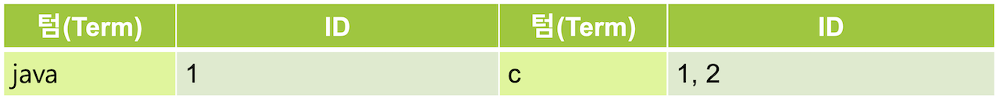
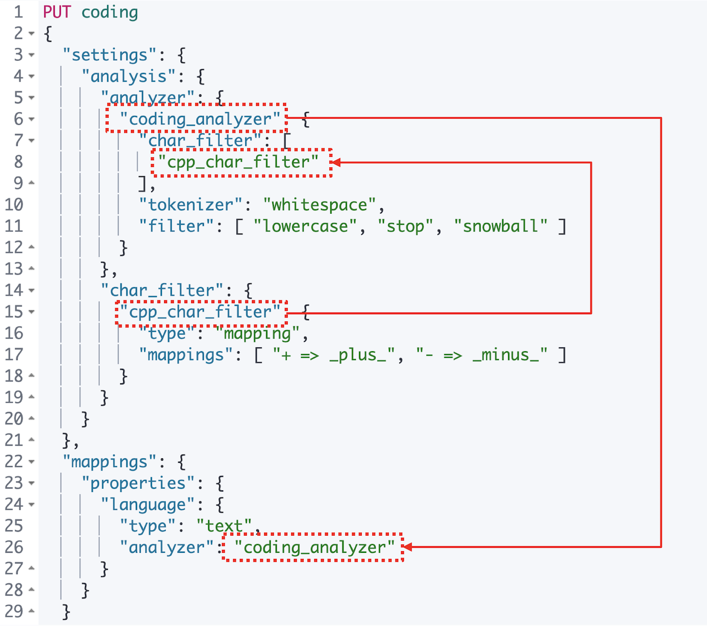
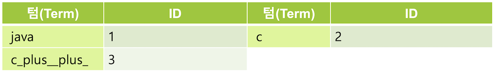

# 6.4.2 Mapping

  Mapping 캐릭터 필터를 이용하면 지정한 단어를 다른 단어로 치환이 가능합니다. 특수문자 등을 포함하는 검색 기능을 구현하려는 경우 반드시 적용해야 해서 실제로 캐릭터 필터 중에는 가장 많이 쓰입니다. 다음 예제를 위해 **language** 필드에 값이 **Java**, **C**, **C++** 인 도큐먼트들이 있는 **coding** 인덱스를 생성 해 보겠습니다.



```javascript
POST coding/_bulk
{"index":{"_id":"1"}}
{"language":"Java"}
{"index":{"_id":"2"}}
{"language":"C"}
{"index":{"_id":"3"}}
{"language":"C++"}
```



  이제 coding 인덱스에서 match 쿼리로 **C++** 을 검색 해 보겠습니다.





```javascript
GET coding/_search
{
  "query": {
    "match": {
      "language": "C++"
    }
  }
}
```







```javascript
{
  "took" : 255,
  "timed_out" : false,
  "_shards" : {
    "total" : 1,
    "successful" : 1,
    "skipped" : 0,
    "failed" : 0
  },
  "hits" : {
    "total" : {
      "value" : 2,
      "relation" : "eq"
    },
    "max_score" : 0.47000363,
    "hits" : [
      {
        "_index" : "coding",
        "_type" : "_doc",
        "_id" : "2",
        "_score" : 0.47000363,
        "_source" : {
          "language" : "C"
        }
      },
      {
        "_index" : "coding",
        "_type" : "_doc",
        "_id" : "3",
        "_score" : 0.47000363,
        "_source" : {
          "language" : "C++"
        }
      }
    ]
  }
}
```





  **C++**을 검색했는데 값이 **C**, **C++** 인 두개의 도큐먼트가 결과로 나타났습니다. 검색어를 **C** 또는 **c**로 검색을 해 보아도 동일한 결과가 나타납니다. 도큐먼트가 색인 될 때 **standard** 애널라이저가 적용되면서 **C++**에서 특수문자 **+**는 제거 되고 **C**는 소문자로 처리 되면서 실제로 역 인덱는 **c** 가 저장됩니.



  Match 쿼리로 검색했을 때 검색어 **C++** 도 마찬가지로 standard 애널라이저가 적용되어 **c** 로 검색을 수행하여 `"_id" : "1"`, `"_id" : "2"` 인 도큐먼트들이 결과로 나타나게 됩니다. standard 뿐 아니라 대다수의 애널라이저들이 특수문자에 대해서는 불용어로 간주하고 제거 해 버리기 때문에 특수문자가 포함된 검색어들을 검색하려면 먼저 특수문자를 다른 문자로 치환해서 저장해야 합니다.

  **C++** 텀을 **cpp** 처럼 치환하는 방법도 있는데, 이 경우라면 검색될 가능성이 있는 특수문자를 포함하는 모든 텀을 치환 해 주어야 하기 때문에 다소 번거롭습니다. 여기서는 특수문자 `+` 를 `_plus_` 라는 단어로 치환해서 색인을 해 보도록 하겠습니다. coding 인덱스를 삭제하고 `mapping` 캐릭터 필터를 이용해서 인덱스의 매핑을 새로 지정 한 뒤 앞의 \_bulk 명령으로 입력했던 도큐먼트들을 다시 색인 해 보도록 합니다.



```javascript
PUT coding
{
  "settings": {
    "analysis": {
      "analyzer": {
        "coding_analyzer": {
          "char_filter": [
            "cpp_char_filter"
          ],
          "tokenizer": "whitespace",
          "filter": [ "lowercase", "stop", "snowball" ]
        }
      },
      "char_filter": {
        "cpp_char_filter": {
          "type": "mapping",
          "mappings": [ "+ => _plus_", "- => _minus_" ]
        }
      }
    }
  },
  "mappings": {
    "properties": {
      "language": {
        "type": "text",
        "analyzer": "coding_analyzer"
      }
    }
  }
}
```





  `+` 기호는 `_plus_` 로, `-` 기호는 `_minus_` 로 치환하는 **cpp\_char\_filter** 라는 캐릭터 필터를 생성했습니다. 그리고 **cpp\_char\_filter** 캐릭터 필터와, whitespace 토크나이저, lowercase, stop, snowball 토큰필터들로 구성된 **coding\_analyzer** 애널라이저를 생성해서 **language** 필드에 적용을 시켰습니다.

  이제 **C++** 로 검색을 해 보면 **C++** 를 가지고 있는 도큐먼트 하나만 검색이 됩니다.





```javascript
GET coding/_search
{
  "query": {
    "match": {
      "language": "C++"
    }
  }
}
```







```javascript
{
  "took" : 2,
  "timed_out" : false,
  "_shards" : {
    "total" : 1,
    "successful" : 1,
    "skipped" : 0,
    "failed" : 0
  },
  "hits" : {
    "total" : {
      "value" : 1,
      "relation" : "eq"
    },
    "max_score" : 0.9808292,
    "hits" : [
      {
        "_index" : "coding",
        "_type" : "_doc",
        "_id" : "3",
        "_score" : 0.9808292,
        "_source" : {
          "language" : "C++"
        }
      }
    ]
  }
}
```





    새로운 애널라이저 적용 후에 단어 **C++** 는 `+` 가 `_plus_` 로 변경된 **C\_plus\_\_plus\_** 로 치환되어 색인이 됩니다. 이후 토크나이저 토큰필터를 거치며 새로운 역 인덱스 다음과 같이 생성됩니다.



  match 쿼리로 검색을 하면 검색어 **C++** 역시 동일한 애널라이저가 적용되어 **c\_plus\_\_plus\_** 로 바뀌어 검색됩니다. 그렇기 때문에 텀 **c\_plus\_\_plus\_** 가 해당되는 `"_id" : "3"` 도큐먼트만 검색이 되게 됩니다.

