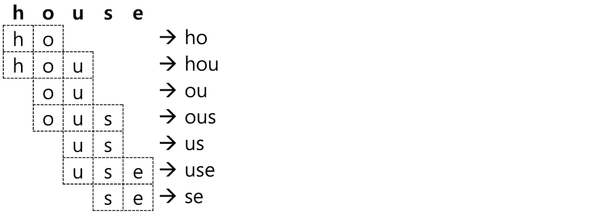
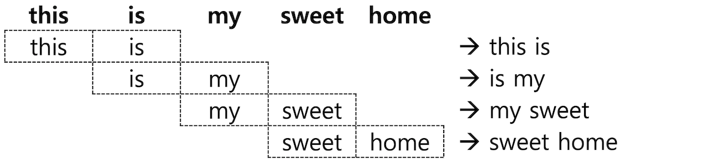

# 6.6.4 NGram, Edge NGram, Shingle

### NGram

  Elasticsearch는 빠른 검색을 위해 검색에 사용될 텀 들을 미리 분리해서 역 인덱스에 저장합니다. 하지만 과학 용어집 검색 같은 특정한 사용 사례에 따라 텀이 아닌 단어의 일부만 가지고도 검색해야 하는 기능이 필요한 경우도 있습니다. RDBMS의 LIKE 검색 처럼 사용하는 **wildcard** 쿼리나 **regexp \(정규식\)** 쿼리도 지원을 하지만, 이런 쿼리들은 메모리 소모가 많고 느리기 때문에 Elasticsearch의 장점을 활용하지 못합니다. 이런 사용을 위해 검색 텀의 일부만 미리 분리해서 저장을 할 수 있는데 이렇게 단어의 일부를 나눈 부위를 **NGram** 이라고 합니다. 보통은 **unigram**\(유니그램 – 1글자\), **bigram**\(바이그램 - 2자\) 등으로 부릅니다.

  Elasticsearch는 **NGram**을 처리하는 토큰 필터를 제공하며 설정은 `"type": "nGram"` 으로 합니다. **"house"** 라는 단어를 2 글자의 NGram \(bigram\) 으로 처리하면 다음과 같이 "**ho"**, **"ou"**, **"us"**, **"se"** 총 4개의 토큰들이 추출됩니다. ngram 토큰필터를 사용하면 이렇게 2글자씩 추출된 텀들이 모두 검색 토큰으로 저장됩니다. 이제 이 인덱스의 경우에는 검색어를 **"ho"** 라고만 검색을 해도 **ho**use 가 포함된 도큐먼트들이 검색이 됩니다.



**ngram** 토큰필터를 사용하면 저장되는 텀의 갯수도 기하급수적으로 늘어나고 검색어를 **"ho"**로 검색 했을 때 **ho**use, s**ho**es 처럼 검색 결과를 예상하기 어렵기 때문에 일반적인 텍스트 검색에는 사용하지 않는 것이 좋습니다. ngram을 사용하기 적합한 사례는 카테고리 목록이나 태그 목록과 같이 전체 개수가 많지 않은 데이터 집단에 **자동완성** 같은 기능을 구현하는 데에 적합합니다.


  ngram 토큰 필터에는 `min_gram` \(디폴트 1\), `max_gram` \(디폴트 2\) 옵션이 있습니다. 짐작할 수 있듯이 최소, 최대 문자수의 토큰을 구분하는 단위입니다. **house**를 `"min_gram": 2`, `"max_gram": 3` 으로 설정하면 다음과 같이 분석되어 총 7개의 토큰을 저장합니다.



  다음은 **my\_ngram** 인덱스에 `"min_gram": 2`, `"max_gram": 3` 인 **my\_ngram\_f** 토큰필터를 만들고 house 를 분석하는 예제입니다.


```javascript
PUT my_ngram
{
  "settings": {
    "analysis": {
      "filter": {
        "my_ngram_f": {
          "type": "nGram",
          "min_gram": 2,
          "max_gram": 3
        }
      }
    }
  }
}
```





```javascript
GET my_ngram/_analyze
{
  "tokenizer": "keyword",
  "filter": [
    "my_ngram_f"
  ],
  "text": "house"
}
```





```javascript
{
  "tokens" : [
    {
      "token" : "ho",
      "start_offset" : 0,
      "end_offset" : 5,
      "type" : "word",
      "position" : 0
    },
    {
      "token" : "hou",
      "start_offset" : 0,
      "end_offset" : 5,
      "type" : "word",
      "position" : 0
    },
    {
      "token" : "ou",
      "start_offset" : 0,
      "end_offset" : 5,
      "type" : "word",
      "position" : 0
    },
    {
      "token" : "ous",
      "start_offset" : 0,
      "end_offset" : 5,
      "type" : "word",
      "position" : 0
    },
    {
      "token" : "us",
      "start_offset" : 0,
      "end_offset" : 5,
      "type" : "word",
      "position" : 0
    },
    {
      "token" : "use",
      "start_offset" : 0,
      "end_offset" : 5,
      "type" : "word",
      "position" : 0
    },
    {
      "token" : "se",
      "start_offset" : 0,
      "end_offset" : 5,
      "type" : "word",
      "position" : 0
    }
  ]
}
```




### Edge NGram

  검색을 위해 NGram을 저장하더라도 보통은 단어의 맨 앞에서부터 검색하는 경우가 많습니다. 텀 앞쪽의 ngram 만 저장하기 위해서는 **Edge NGram** 토큰필터를 이용합니다. 설정 방법은 `"type": "edgeNGram"` 입니다. edgeNGram의 옵션을 `"min_gram": 1`, `"max_gram": 4` 으로 설정하고 "**house"** 를 분석하면 다음과 같이 **"h", "ho", "hou", "hous"** 4개의 토큰이 생성됩니다.


  인덱스 설정과 쿼리를 이용한 애널라이저 분석은 위의 NGram 예제를 참고해서 직접 만들어 보시기 바랍니다.

### Shingle

  **NGram**과 **Edge NGram**은 모두 하나의 단어로부터 토큰을 확장하는 토큰 필터입니다. 문자가 아니라 단어 단위로 구성된 묶음을 **Shingle** 이라고 하며 `"type": "shingle"` 토큰 필터의 이용이 가능합니다. **"this is my sweet home"** 라는 문장을 분리해서 **2 단어씩 Shingle** 토큰 필터를 적용하면 다음과 같은 4개의 **shingle** 들이 생성됩니다.



  **Shingle** 토큰 필터에서 사용 가능한 옵션은 다음과 같습니다.

* **min\_shingle\_size** / **max\_shingle\_size** : shingle의 최소 / 최대 단어 개수를 지정합니다. 디폴트는 모두 2 입니다.
* **output\_unigrams** : Shingle 외에도 각각의 개별 토큰\(unigram\)도 저장 하는지의 여부를 설정합니다. 디폴트는 true 입니다.
* **output\_unigrams\_if\_no\_shingles** : shingle 을 만들 수 없는 경우에만 개별 토큰을 저장하는지의 여부를 설정합니다. 디폴트는 false 입니다.
* **token\_separator** : 토큰 구분자를 지정합니다. 디폴트는 `" "` \(스페이스\) 입니다.
* **filler\_token** : shing을 만들 텀이 없는 경우 \(보통은 stop 토큰 필터와 함께 사용되어 offset 위치만 있고 텀이 없는 경우입니다\) 대체할 텍스트를 지정합니다. 디폴트는 `_` 입니다.

  다음은 **my\_shingle** 인덱스에서 `"min_shingle_size": 3`, `"max_shingle_size": 4` 로 설정해서 **"this is my sweet home"** 문장을 분석하는 예제입니다.


```javascript
PUT my_shingle
{
  "settings": {
    "analysis": {
      "filter": {
        "my_shingle_f": {
          "type": "shingle",
          "min_shingle_size": 3,
          "max_shingle_size": 4
        }
      }
    }
  }
}
```





```javascript
GET my_shingle/_analyze
{
  "tokenizer": "whitespace",
  "filter": [
    "my_shingle_f"
  ],
  "text": "this is my sweet home"
}
```





```javascript
{
  "tokens" : [
    {
      "token" : "this",
      "start_offset" : 0,
      "end_offset" : 4,
      "type" : "word",
      "position" : 0
    },
    {
      "token" : "this is my",
      "start_offset" : 0,
      "end_offset" : 10,
      "type" : "shingle",
      "position" : 0,
      "positionLength" : 3
    },
    {
      "token" : "this is my sweet",
      "start_offset" : 0,
      "end_offset" : 16,
      "type" : "shingle",
      "position" : 0,
      "positionLength" : 4
    },
    {
      "token" : "is",
      "start_offset" : 5,
      "end_offset" : 7,
      "type" : "word",
      "position" : 1
    },
    {
      "token" : "is my sweet",
      "start_offset" : 5,
      "end_offset" : 16,
      "type" : "shingle",
      "position" : 1,
      "positionLength" : 3
    },
    {
      "token" : "is my sweet home",
      "start_offset" : 5,
      "end_offset" : 21,
      "type" : "shingle",
      "position" : 1,
      "positionLength" : 4
    },
    {
      "token" : "my",
      "start_offset" : 8,
      "end_offset" : 10,
      "type" : "word",
      "position" : 2
    },
    {
      "token" : "my sweet home",
      "start_offset" : 8,
      "end_offset" : 21,
      "type" : "shingle",
      "position" : 2,
      "positionLength" : 3
    },
    {
      "token" : "sweet",
      "start_offset" : 11,
      "end_offset" : 16,
      "type" : "word",
      "position" : 3
    },
    {
      "token" : "home",
      "start_offset" : 17,
      "end_offset" : 21,
      "type" : "word",
      "position" : 4
    }
  ]
}
```




  `"token" : "this is my"`, `"token" : "this is my sweet"` 와 같은 토큰들이 저장된 것을 확인할 수 있습니다. 이번에는 `"output_unigrams": false` 와 `"filler_token": "-"` 설정을 추가하고 stop 토큰필터로 `"is"` 를 불용어 처리한 뒤 실행 해 보겠습니다.


```javascript
PUT my_shingle
{
  "settings": {
    "analysis": {
      "filter": {
        "my_shingle_f": {
          "type": "shingle",
          "min_shingle_size": 3,
          "max_shingle_size": 4,
          "output_unigrams": false,
          "filler_token": "-"
        },
        "my_stop_f": {
          "type": "stop",
          "stopwords": [
            "is"
          ]
        }
      }
    }
  }
}
```





```javascript
GET my_shingle/_analyze
{
  "tokenizer": "whitespace",
  "filter": [
    "my_stop_f",
    "my_shingle_f"
  ],
  "text": "this is my sweet home"
}
```





```javascript
{
  "tokens" : [
    {
      "token" : "this - my",
      "start_offset" : 0,
      "end_offset" : 10,
      "type" : "shingle",
      "position" : 0
    },
    {
      "token" : "this - my sweet",
      "start_offset" : 0,
      "end_offset" : 16,
      "type" : "shingle",
      "position" : 0,
      "positionLength" : 2
    },
    {
      "token" : "- my sweet",
      "start_offset" : 8,
      "end_offset" : 16,
      "type" : "shingle",
      "position" : 1
    },
    {
      "token" : "- my sweet home",
      "start_offset" : 8,
      "end_offset" : 21,
      "type" : "shingle",
      "position" : 1,
      "positionLength" : 2
    },
    {
      "token" : "my sweet home",
      "start_offset" : 8,
      "end_offset" : 21,
      "type" : "shingle",
      "position" : 2
    }
  ]
}
```




  단일 토큰들은 모두 삭제되었고 `"is"` 는 `"-"` 로 대치된 3, 4개 단어로 이루어진 shingle 들이 생성된 것을 확인할 수 있습니다.


**NGram**, **Edged NGram** 그리고 **Shingle** 토큰 필터는 보통 일반적인 텍스트 분석에 사용하기는 적합하지 않습니다. 하지만 자동 완성 기능을 구현하거나 프로그램 코드 안에서 문법이나 기능명을 검색하는 것과 같이 특수한 요구사항을 충족해야 하는 경우 유용하게 사용될 수 있습니다.


