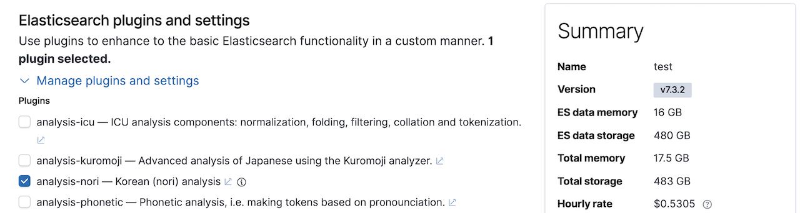

# 6.7.2 Nori 노리 한글 형태소 분석기

### 커뮤니티 한글 형태소 분석기 - 아리랑, 은전한닢, Open Korean Text

  한글은 형태의 변형이 매우 복잡한 언어입니다. 특히 복합어, 합성어 등이 많아 하나의 단어도 여러 어간으로 분리해야 하는 경우가 많아 한글을 형태소 분석을 하려면 반드시 한글 형태소 사전이 필요합니다. 오픈 소스 커뮤니티에서 개발되어 Elasticsearch에서 사용 가능한 한글 형태소 분석기는 다음과 같은 것들이 있습니다.

* 아리랑 \(arirang\)
  * URL: [https://github.com/HowookJeong/elasticsearch-analysis-arirang](https://github.com/HowookJeong/elasticsearch-analysis-arirang)
  * 설명: korean analyzer \(lucene analyzer kr arirang\)
  * License: as-is
* 은전한닢 \(seunjeon\)
  * URL: [https://bitbucket.org/eunjeon/seunjeon](https://bitbucket.org/eunjeon/seunjeon)
  * 설명: mecab-ko-dic 기반으로 만들어진 JVM 상에서 돌아가는 한국어 형태소분석기입니다. 기본적으로 java와 scala 인터페이스를 제공합니다. 사전이 패키지 내에 포함되어 있기 때문에 별도로 mecab-ko-dic을 설치할 필요가 없습니다. 특징으로는 \(시스템 사전에 등록되어 있는 단어에 한하여\) 복합명사 분해와 활용어 원형 찾기가 가능합니다.
  * License: Apache 2.0
* Open Korean Text 
  * URL: [https://github.com/open-korean-text/open-korean-text](https://github.com/open-korean-text/open-korean-text)
  * 설명: 오픈소스 한국어 처리기 \(Official Fork of twitter-korean-text\). 스칼라로 쓰여진 한국어 처리기입니다. 현재 텍스트 정규화와 형태소 분석, 스테밍을 지원하고 있습니다. 짧은 트윗은 물론이고 긴 글도 처리할 수 있습니다.
  * License: Apache 2.0

\([https://www.elastic.co/kr/blog/using-korean-analyzers](https://www.elastic.co/kr/blog/using-korean-analyzers) 에서 발췌\)

  Elasticsearch가 한글을 지원하지 않던 시절에 위의 형태소 분석기들은 한글 사용자들에게 큰 도움이 되었습니다. 하지만 외부에서 만들어진 기능이다 보니 Elasticsearch 버전이 올라가 구조가 변경되면 사용이 불가능해지고, 버그가 오류가 있어도 누군가가 나서서 쉽게 고치기 어려운 문제가 있었습니다.

### Nori 개요

  Elasticsearch 6.6 버전 부터 공식적으로 **Nori\(노리\)** 라고 하는 한글 형태소 분석기를 Elastic사에서 공식적으로 개발해서 지원을 하기 시작했습니다. 특이하게 nori는 프랑스 엔지니어인 [Jim Ferenczi](https://github.com/jimczi) 에 의해 처음 개발이 되었습니다. Jim 은 아파치 루씬의 커미터이며 Elasticsearch의 일본어 형태소 분석기인 **Kuromoji\(구로모지\)** 역시 Jim 이 처음 개발했습니다. Nori 는 **은전한닢**에서 사용하는 **mecab-ko-dic** 사전을 재 가공 하여 사용하고 있습니다. Nori 는 루씬의 기능으로 개발되었으며 루씬 소스에 반영되어 있으며 개발 이력은  
[https://issues.apache.org/jira/browse/LUCENE-8231](https://issues.apache.org/jira/browse/LUCENE-8231)  
에서 확인 할 수 있고 프로그램 소스는  
[https://github.com/apache/lucene-solr/tree/master/lucene/analysis/nori](https://github.com/apache/lucene-solr/tree/master/lucene/analysis/nori)  
에서 확인이 가능합니다.

  Nori 에 관련한 설명은 공식 홈페이지의 문서 페이지의 [Elasticsearch : Plugins and Integrations &gt; Analysis Plugins &gt; Nori](https://www.elastic.co/guide/en/elasticsearch/plugins/current/analysis-nori.html) 페이지에서 찾을 수 있습니다.

### Nori 설치

  Nori 를 사용하기 위해서는 먼저 elasticsearch에 analysis-nori 플러그인을 설치해야 합니다. elasticsearch 홈 디렉토리에서 다음 명령을 실행하면 버전에 맞는 nori 플러그인을 받아서 자동으로 설치합니다.



```bash
$ bin/elasticsearch-plugin install analysis-nori
```



  설치된 nori 플러그인을 제거하려면 다음 명령을 실행합니다.



```bash
$ bin/elasticsearch-plugin remove analysis-nori
```



[Elastic 클라우드 서비스](https://cloud.elastic.co/)에서 사용하기 위해서는 클러스터를 배포할 때 Customize deployment 메뉴의 Manage plugins and settings 부분에서 analysis-nori 부분을 선택합니다.



### nori\_tokenizer


