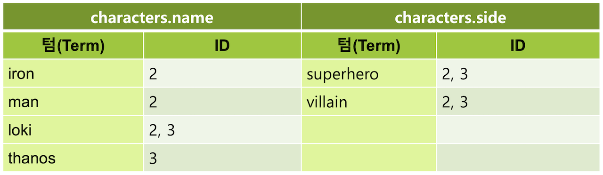

# 7.2.5 Object 와 Nested

### Object

  JSON 에서는 한 필드 안에 하위 필드를 넣는 **object**, 즉 **객체** 타입의 값을 사용할 수 있습니다. 보통은 한 요소가 여러 하위 정보를 가지고 있는 경우 object 타입 형태로 사용합니다. 다음은 **movie** 인덱스에 하위 필드 **"name"**, **"age"**, **"side"** 를 가진 **object** 타입 **"characters"** 필드의 예제입니다.



```javascript
PUT movie/_doc/1
{
  "characters": {
    "name": "Iron Man",
    "age": 46,
    "side": "superhero"
  }
}
```



  object 필드를 선언 할 때는 다음과 같이 `"properties"` 를 입력하고 그 아래에 하위 필드 이름과 타입을 지정합니다.



```javascript
PUT movie
{
  "mappings": {
    "properties": {
      "characters": {
        "properties": {
          "name": {
            "type": "text"
          },
          "age": {
            "type": "byte"
          },
          "side": {
            "type": "keyword"
          }
        }
      }
    }
  }
}
```



  object 필드를 쿼리로 검색 하거나 집계를 할 때는 다음과 같이 마침표 `.` 를 이용해서 하위 필드에 접근합니다.





```javascript
GET movie/_search
{
  "query": {
    "match": {
      "characters.name": "Iron Man"
    }
  }
}
```







```javascript
{
  "took" : 262,
  "timed_out" : false,
  "_shards" : {
    "total" : 1,
    "successful" : 1,
    "skipped" : 0,
    "failed" : 0
  },
  "hits" : {
    "total" : {
      "value" : 1,
      "relation" : "eq"
    },
    "max_score" : 0.5753642,
    "hits" : [
      {
        "_index" : "movie",
        "_type" : "_doc",
        "_id" : "1",
        "_score" : 0.5753642,
        "_source" : {
          "characters" : {
            "name" : "Iron Man",
            "age" : 46,
            "side" : "superhero"
          }
        }
      }
    ]
  }
}
```






Elasticsearch에는 따로 배열\(array\) 타입의 필드를 선언하지 않습니다. 필드 타입의 값만 일치하면 다음과 같이 값을 배열로도 넣을 수 있습니다.

* { "title": "Romeo and Juliet" }
* { "title": \[ "Romeo and Juliet", "Hamlet" \] }


  이번에는 다음과 같이 **title** 필드 값이 각각 **"The Avengers"**, **"Avengers: Infinity War"** 이고 **characters** 필드에 object 값이 2개씩 들어있는 두 개의 도큐먼트를 입력 해 보겠습니다.



```javascript
PUT movie/_doc/2
{
  "title": "The Avengers",
  "characters": [
    {
      "name": "Iron Man",
      "side": "superhero"
    },
    {
      "name": "Loki",
      "side": "villain"
    }
  ]
}

PUT movie/_doc/3
{
  "title": "Avengers: Infinity War",
  "characters": [
    {
      "name": "Loki",
      "side": "superhero"
    },
    {
      "name": "Thanos",
      "side": "villain"
    }
  ]
}
```



  두 개 도큐먼트 모두 characters 필드의 하위 필드 값으로 `"name": "Loki"` 가 있습니다. 그리고 한 도큐먼트는 "name": "Loki" 의 "side" 필드 값이 **"villain"** 이고 다른 도큐먼트는 **"superhero"** 입니다. 이제 characters 필드의 name 값은 "Loki" 이고 side 값은 "villain" 인 도큐먼트를 검색 해 보겠습니다.





```javascript
GET movie/_search
{
  "query": {
    "bool": {
      "must": [
        {
          "match": {
            "characters.name": "Loki"
          }
        },
        {
          "match": {
            "characters.side": "villain"
          }
        }
      ]
    }
  }
}
```







```javascript
{
  "took" : 2,
  "timed_out" : false,
  "_shards" : {
    "total" : 1,
    "successful" : 1,
    "skipped" : 0,
    "failed" : 0
  },
  "hits" : {
    "total" : {
      "value" : 2,
      "relation" : "eq"
    },
    "max_score" : 1.0611372,
    "hits" : [
      {
        "_index" : "movie",
        "_type" : "_doc",
        "_id" : "3",
        "_score" : 1.0611372,
        "_source" : {
          "title" : "Avengers: Infinity War",
          "characters" : [
            {
              "name" : "Loki",
              "side" : "superhero"
            },
            {
              "name" : "Thanos",
              "side" : "villain"
            }
          ]
        }
      },
      {
        "_index" : "movie",
        "_type" : "_doc",
        "_id" : "2",
        "_score" : 0.9827781,
        "_source" : {
          "title" : "The Avengers",
          "characters" : [
            {
              "name" : "Iron Man",
              "side" : "superhero"
            },
            {
              "name" : "Loki",
              "side" : "villain"
            }
          ]
        }
      }
    ]
  }
}
```





  분명 `{"name": "Loki", "side": "villain"}` 값을 포함하고 있는 도큐먼트는 `"_id" : "2"` 인 `"title": "The Avengers"` 도큐먼트 뿐인데 `{"name": "Loki", "side": "superhero"}` 를 포함하고 있는 `"title": "Avengers: Infinity War"` 도큐먼트도 같이 검색이 되었습니다. _\(심지어 스코어도 더 높습니다\)_

  얼핏 생각했을 때는 `"title": "The Avengers"` 도큐먼트만 검색이 되어야 맞는 것으로 생각이 되는데 실제 결과는 그렇지가 않습니다. 이유는 Elasticsearch는 위 예제에서 역 색인을 다음과 같은 모양으로 생성하기 때문입니다. 기억하세요. 역 색인은 필드 별로 생성됩니다.



  역 색인에서는 object 필드의 하위 필드들은 모두 상위 필드의 이름과 함께 펼쳐져서 한 필드로 저장이 됩니다. 그렇기 때문에 `"characters.name": "Loki"`, `"characters.side": "villain"` 두 필드값들은 `"_id" : "2"` , `"_id" : "3"` 두 도큐먼트 모두를 리턴합니다.

### Nested

  만약에 object 타입 필드에 있는 여러 개의 object 값들이 서로 다른 역 색인 구조를 갖도록 하려면 **nested** 타입으로 지정해야 합니다. nested 타입으로 지정하려면 매핑에 다음과 같이 `"type": "nested"` 를 명시합니다. 다른 부분은 object 와 동일합니다.



```javascript
PUT movie
{
  "mappings": {
    "properties": {
      "characters": {
        "type": "nested",
        "properties": {
          "name": {
            "type": "text"
          },
          "side": {
            "type": "keyword"
          }
        }
      }
    }
  }
}
```



  입력할 데이터는 의 object 예제에서 입력 한 데이터와 동일합니다. 매핑을 위와 같이 nested 형식으로 선언하고 앞에서 했던 **title** 필드 값이 각각 **"The Avengers"**, **"Avengers: Infinity War"** 이고 characters 필드에 object 값이 2개씩 들어있는 두 개의 도큐먼트를 다시 한번 입력 해 보도록 합니다. 그 뒤 다시 characters 필드의 name 값은 **"Loki"** 이고 side 값은 **"villain"** 인 도큐먼트를 검색 해 보도록 합니다.





```javascript
GET movie/_search
{
  "query": {
    "bool": {
      "must": [
        {
          "match": {
            "characters.name": "Loki"
          }
        },
        {
          "match": {
            "characters.side": "villain"
          }
        }
      ]
    }
  }
}
```







```javascript
{
  "took" : 1,
  "timed_out" : false,
  "_shards" : {
    "total" : 1,
    "successful" : 1,
    "skipped" : 0,
    "failed" : 0
  },
  "hits" : {
    "total" : {
      "value" : 0,
      "relation" : "eq"
    },
    "max_score" : null,
    "hits" : [ ]
  }
}
```





  검색 결과가 하나도 나타나지 않았습니다.

  nested 필드를 검색 할 때는 반드시 **nested 쿼리**를 써야 합니다. nested 쿼리 안에는 **path** 라는 옵션으로 nested로 정의된 필드를 먼저 명시하고 그 안에 다시 쿼리를 넣어서 입력합니다.





```javascript
GET movie/_search
{
  "query": {
    "nested": {
      "path": "characters",
      "query": {
        "bool": {
          "must": [
            {
              "match": {
                "characters.name": "Loki"
              }
            },
            {
              "match": {
                "characters.side": "villain"
              }
            }
          ]
        }
      }
    }
  }
}
```







```javascript
{
  "took" : 1,
  "timed_out" : false,
  "_shards" : {
    "total" : 1,
    "successful" : 1,
    "skipped" : 0,
    "failed" : 0
  },
  "hits" : {
    "total" : {
      "value" : 1,
      "relation" : "eq"
    },
    "max_score" : 1.4480599,
    "hits" : [
      {
        "_index" : "movie",
        "_type" : "_doc",
        "_id" : "2",
        "_score" : 1.4480599,
        "_source" : {
          "title" : "The Avengers",
          "characters" : [
            {
              "name" : "Iron Man",
              "side" : "superhero"
            },
            {
              "name" : "Loki",
              "side" : "villain"
            }
          ]
        }
      }
    ]
  }
}
```





  결과로 `{"name" : "Loki", "side" : "villain"}` 값을 포함하고 있는 `"_id" : "2"` 도큐먼트만 검색이 되었습니다.

  nested 쿼리로 검색하면 nested 필드의 내부에 있는 값 들을 모두 별개의 도큐먼트로 취급합니다. 앞의 예제에서 본 object 도큐먼트와 nested 도큐먼트를 그림으로 비교 해 보면 다음과 같습니다.

