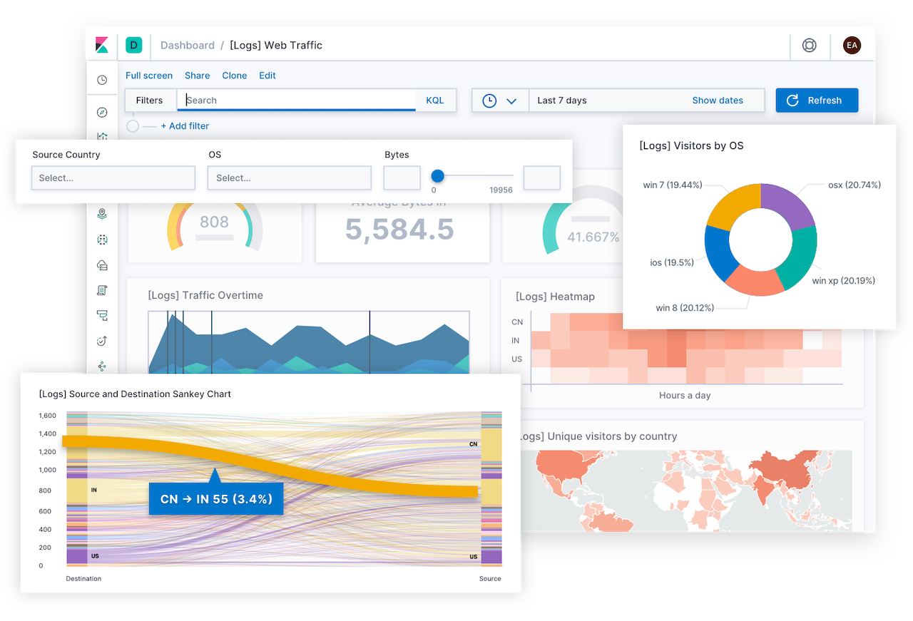

# 8. 집계 \(Aggregations\)

  Elasticsearch 는 검색엔진으로 개발되었지만 지금은 로그분석을 비롯해 다양한 목적의데이터 시스템으로 사용되고 있습니다. Elasticsearch가 이렇게 다양한 용도로 활용이 될 수 있는 이유는 데이터를 단순히 검색만 하는 것이 아니라 여러가지 연산을 할 수 있는 **Aggregation** 기능이 있기 때문입니다. Kibana 에서는 다음과 같이 바 차트, 파이 차트 등으로 데이터를 시각화 할 수 있는데 여기서 사용하는 것이 이 기능입니다.

  Aggregation 은 번역하면 "집계" 라는 뜻 이지만 Elasticsearch 의 기능명 이기 때문에 보통 Elastic Stack 관련 세미나 또는 블로그 포스트에서는 원문대로 **aggregation** 혹은 **애그리게이션** 으로 많이 표현합니다. 이 책에서도 **Aggregation** 으로 표현하도록 하겠습니다.

